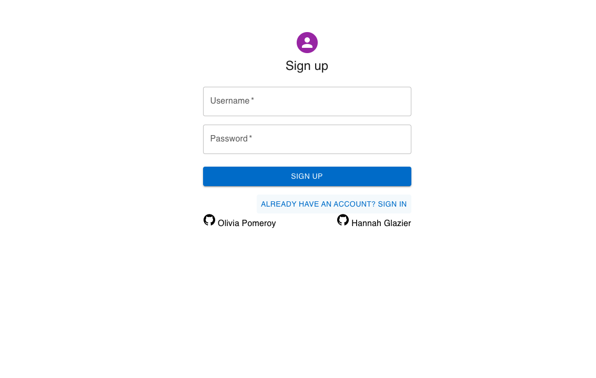
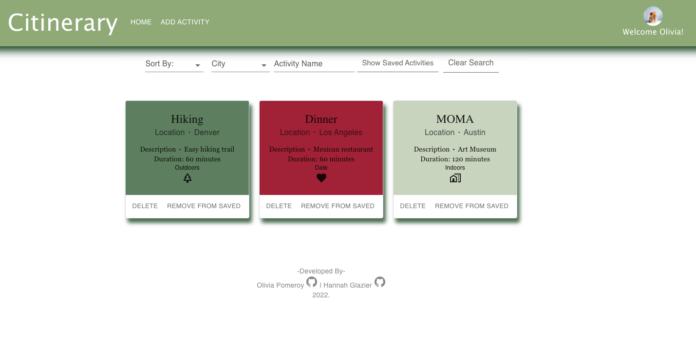
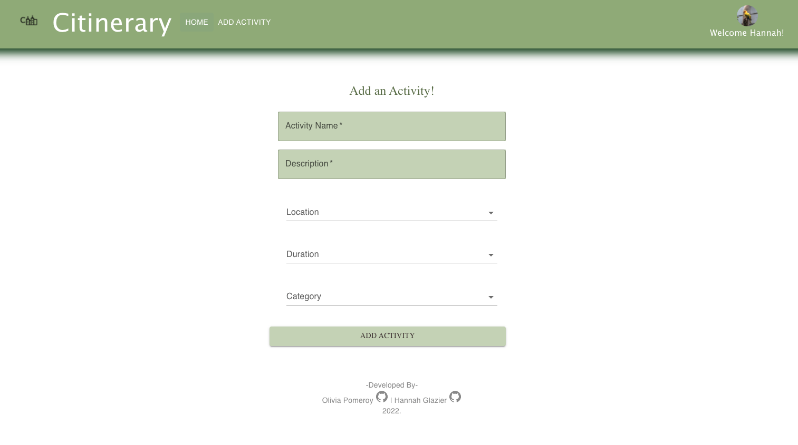
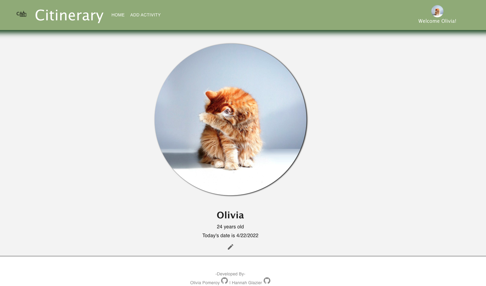
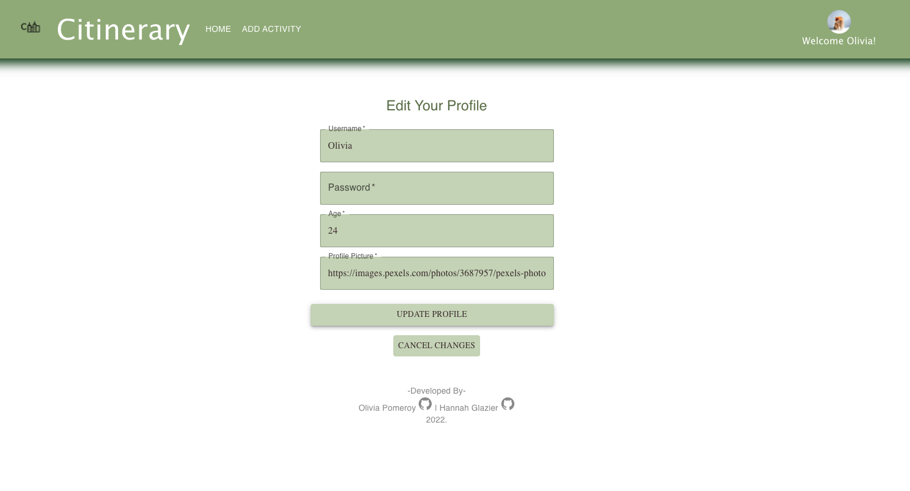

# Citinerary
Citinerary is an application that allows users to view various activities in different cities in order to plan out trips or fun activities in their hometown. Please find our application deployed and linked [Here](https://powerful-harbor-52595.herokuapp.com/).

## User Stories
Users are able to create an account and login from an initial sign in page. Once they are signed in, users are able to view activities in different cities and filter these by default, activity name, duration, and city. Activities can also be searched by name. Users are also able to add activities to their own activity list. Users have their own profile page and are also able to add personalized activities to the site. 

## Walkthrough Snapshots
[Video Walkthrough](https://www.loom.com/share/7ba3bb02e9164e7583826d4d950e9175)

## Signin:

## Signup:

## Home:

## My Activities:

## Add Activity:

## Profile:

## Edit Profile:

## Backend
This application's backend was built with Ruby on Rails. After cloning, the backend can be launched by runing `rails db:migrate` to set up the database, `rails db:seed` to seed some initial seed data, and `bundle install` to install the necessary dependencies. Finally, you can run `rails s` to launch the server.

## Frontend
This application's frontend was created with HTML, JavaScript, React, CSS, and Material UI. After cloning, the frontend can be launched by running `npm install --prefix client` to install the necessary dependencies and `npm start --prefix client` to launch the frontend server. 

## Contributing to Citinerary
<!--- If your README is long or you have some specific process or steps you want contributors to follow, consider creating a separate CONTRIBUTING.md file--->
To contribute to Citinerary, follow these steps:

1. Fork this repository.
2. Create a branch: `git checkout -b <branch_name>`.
3. Make your changes and commit them: `git commit -m '<commit_message>'`
4. Push to the original branch: `git push origin main`
5. Create the pull request.

Alternatively see the GitHub documentation on [creating a pull request](https://help.github.com/en/github/collaborating-with-issues-and-pull-requests/creating-a-pull-request).

## Created By:

### Olivia Pomeroy

Github: https://github.com/opomeroy26

LinkedIn: https://www.linkedin.com/in/olivia-pomeroy/

### Hannah Glazier:

Github: https://github.com/HannahGlazier

LinkedIn: https://www.linkedin.com/in/hannah-glazier-3a214a231/
